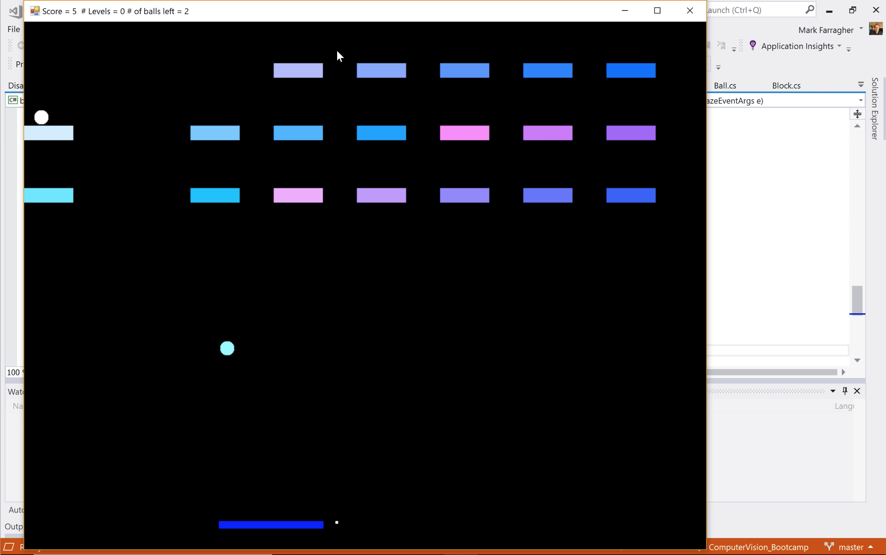

# Gaze Project

This project uses the OpenFace gaze detector to control the paddle in a game of Breakout. You play the game by glancing
left or right, and the paddle will move to where your gaze is directed.

